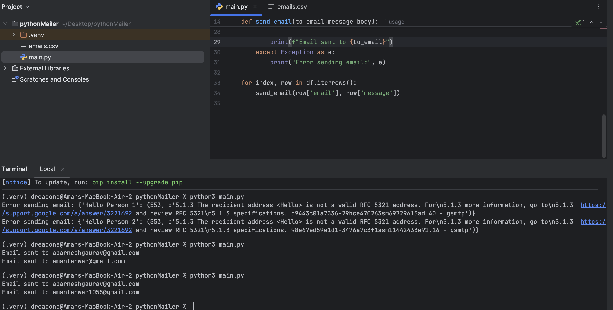

### Steps

## Creating google app password

Step 1: Go to your google account -> then security -> then enable 2-step verification if its off -> also disable any passkeys/google prompt

Step 2: Now login using your google account on this link: https://myaccount.google.com/apppasswords -> then it will ask for app name, so write app name -> then it will show you a 16-character password, copy it.

---

## Code walkthrough

1: Only dependency to install is pandas so Install pandas:

pip install pandas

2: In line 6,7 of main.py edit the sender email and in app password the 16 digit code we copied earlier.

3: You can change Subject at line 18 in main.py

4: Now change the csv file accordingly and then you can run the file.

It will display the names in the console of whether someone has received it or if there is an error.

---

### Output sample

